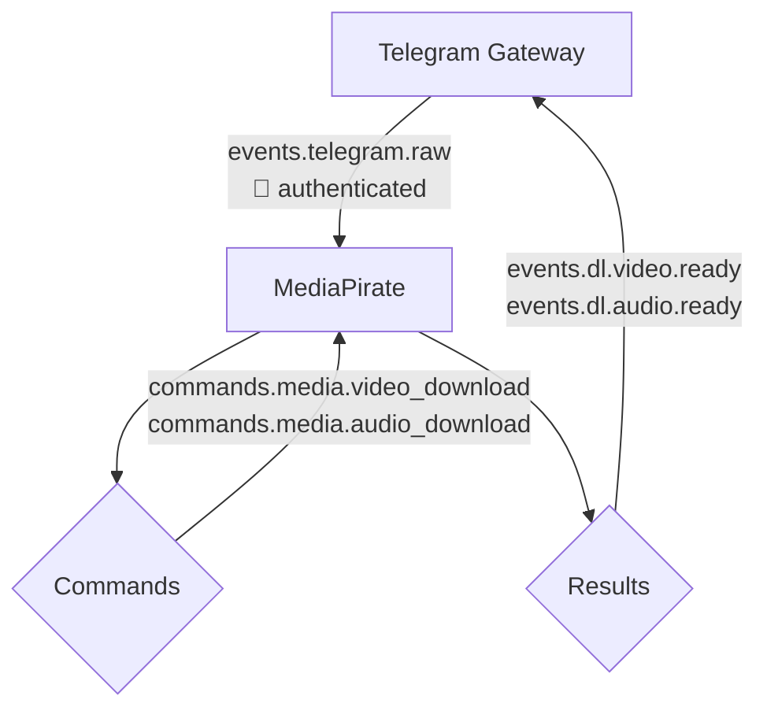
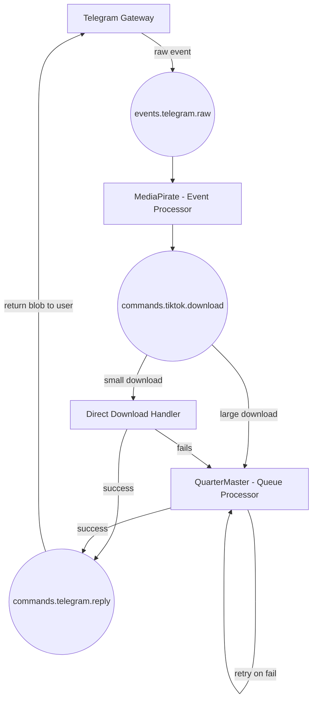

# Heavy Telegram Bot

## Project Overview

This repository contains the core infrastructure and microservices for an event-driven Telegram user-bot ecosystem. The project is intentionally overengineered — an experiment in distributed systems and event choreography using modern tooling.

⚠️ This project logs in as a user account using MTProto. Be aware that using userbots may violate Telegram’s terms of service. Use responsibly and at your own risk.

## Getting Started

1. Start the infrastructure
2. Start the Gateway
3. Start MediaPirate

You should now be able to interact with the bot via Telegram.

## Architecture Decisions

- **Event Choreography over Orchestration** - Services react to events independently
- **Saga Pattern** - Distributed workflow without central coordinator
- **Interest Accumulation** - An approach to handling concurrent requests

### Interest Accumulation

When multiple users request the same media file, we track their interest via a shared Redis key (based on content hash or normalized URL). Once the download completes, all interested parties are notified. This prevents duplicate downloads and reduces resource use.

## Security Model

- Gateway authenticates all incoming requests.
- Correlation IDs, user metadata, or scoped access tokens are attached to events at this boundary.
- Internal services trust messages from the Gateway (or each other) and do not perform redundant authentication.

This approach simplifies each worker’s responsibility and centralizes control.

## Insights

### Event-Driven Architecture & React Development is Surpassingly Similar

Event-based programming has a remarkably similar feel to React programming. Both paradigms share fundamental patterns that make the mental model transferable:

#### Unidirectional Data Flow

- React: Props flow down, events bubble up through component hierarchy
- Event Systems: Events flow through message queues, responses bubble back through services

#### Event Handling

- React: So many ways to do it. `onClick` to handle user click events. `useEffect` to react to changes in reactive state. Most of these functions don't return anything, they just do things.
- Event systems: subscribers listen to events, and do something. It doesnt make sense to return anything when its event based, you just pass it to to the next step in the flow, or end the process.

#### Global State Management

- React: You want to share life up reactive state to share in different parts of your application tree, you reach out for `context` and implement it with a setter and a getter.
- Event Systems: Redis for state management. You can do the set and get keys just the same. But its more powerful, you can set automatic cleanups with TTL (You do have similar ability to clean up in React via returning a cleanup function in a `useEffect`).

#### Event Propagation

- React: Event bubbling through the DOM tree with `stopPropagation()` control
- RabbitMQ: Exchange types (direct, fanout, topic) for controlling event distribution patterns. You can change whether multiple consumers receives the same event, or whether they disappear after an event has been touched by a subscriber.

#### Composition

- React: You can separate out functionality via `hooks` and `components`. Encapsulated boxes that take props and output behavior or UI. Components can be dumb (they don't do business logic, and just react to props) or they can be smart (they take care of business logic, calling endpoints, handling toast notifications)
- Microservices: Break out functionality into its own service. They can either dumbly call other events to handle logic it cant do, or they can take care of everything.

This mental models transfer suggests that frontend developers already possess much of the conceptual framework needed for distributed systems architecture. The shift from "what happens when a button is clicked?" to "what happens when an event is published?" feels very natural.

Both types of programming have similar reactive event-driven flows.

## Infrastructure Services

Infrastructure is managed via Docker Compose in:

- [`infra/docker-compose.yml`](./infra/docker-compose.yml)

This includes:

- 📨 **RabbitMQ** — message broker
- 🧠 **Redis** — cache and ephemeral data store
- 💾 **MinIO** — S3-compatible object storage
- 🧭 **RedisInsight** — Redis UI for debugging and introspection

### Starting Infrastructure

Ensure you’ve configured the necessary environment variables, then start the services:

```bash
docker-compose -f infra/docker-compose.yml up -d
```

## Gateway Service

> **📤 Event Publisher**  
> Listens to Telegram events and publishes them into RabbitMQ.

### What it is

The Gateway service is a Python application that listens to Telegram events using Hydrogram and publishes them to RabbitMQ.

- Located in the [`gateway/`](./gateway) directory.
- See [`gateway/README.md`](./gateway/README.md) for detailed setup and usage instructions.

### Key features

- Associating logs with correlation IDs handling using `contextvars`
- Compute time taken for event to be be received into Gateway and dispatched out of Gateway

#### Rate limiting (🚧 PLANNED)

Strategy: Fixed Window Rate Limiting with TTL

This strategy limits how many actions a user can perform within a fixed time window. It uses a Redis key per user (e.g. rate:user:<id>) to count requests. The counter resets after a set TTL (e.g. 60 seconds), allowing automatic cleanup. If the request count exceeds the allowed limit during the window, further requests are denied until the TTL expires.

### Task Roadmap

- [x] Listen for video downloads events, and upload from minio into telegram
- [ ] Optimize video uploading, by reusing documents already in telegram
- [ ] JSON Schema implementation
- [ ] Implement rate limiting to prevent users from spamming the service
- [ ] Add support for dynamically allowing other users to interact with certain functionality
- [x] Implement basic authentication
- [ ] Implement dynamic authorization and only publish events that have to be worked on
- [ ] Implement rate limiting
- [ ] Implement OpenTelemetry with `contextvars` correlation support
- [ ] Implement Redis TTL-based heartbeat for service health

### Supported Command Words (🚧 PLANNED)

- `.whoami` — tells the user their current status (banned, blessed, or unmolested)
- `.grace <30d?>` — Allow a chat to interact with the bot forever, or with an optional TTL
- `.bless @<username> <30d?>` — Bless user for 30 days, with an optional TTL
- `.smite` — Permanent ban from bot interactions for everyone in chat forever (no TTL)
- `.hammer @<username> <1h?>` — Temporary ban, with an optional TTL

### Running the Gateway Service

Start after infrastructure is running:

```bash
docker-compose -f gateway/docker-compose.yml up -d
```

## MediaPirate Service

> **📥 Event Subscriber & Event Publisher**  
> Consumes raw events from RabbitMQ and processes or delegates them.

### What it is

Media Pirate is a distributed content relay and command system designed to experiment with messaging patterns, service orchestration, and multi-user sync.

- Located in the [`media-pirate/`](./media-pirate) directory.
- See [`media-pirate/README.md`](./media-pirate/README.md) for detailed setup and usage instructions.

### Key features

- Associating logs with correlation IDs handling using `contextvars`
- Injecting `correlation_id` received from Gateway for inter-service context-aware logging
- Content-Based Addressing for object storage
- Fetching from youtube, tiktok is handled in an idempotent manner
- Enriches stored documents with meta data for future analytics

#### Content-Based Addressing

This project uses a content-based addressing strategy to deduplicate downloads and maintain consistency across services. Each media object is identified by a unique hash derived from the normalized source URL (with query parameters stripped) and the extraction type (audio or video). This allows media derived from the same URL — but with different formats or intents — to be treated as distinct entities.

The content hash is used to:

- Uniquely identify media across services
- Prevent redundant downloads/uploads
- Store files in MinIO under type-scoped paths: audio/<hash>.mp3 and video/<hash>.mp4

The full source URL and normalized form are preserved as metadata to ensure traceability, support introspection, and allow for future normalization improvements.

### Task Roadmap

- [x] Handle YouTube downloads directly to disk
- [x] Upload downloaded files to MinIO
- [ ] Enforce file size limits for small downloads
- [ ] Implement durable, idempotent jobs for large downloads with retry support
- [ ] JSON Schema implementation (cross-service payload validations)
- [ ] Handle race condition via interest accumulation. Decouple download requests from download execution - accumulate interested parties and fan-out results for success and failed for all interested parties.
- [ ] Implement OpenTelemetry with `contextvars` correlation support
- [ ] Implement Redis TTL-based heartbeat for service health
- [ ] Reuse downloaded files when doing audio extraction (if a video exists inside the bucket)

### Supported Command Words

- `.vdl <url>` — Download a file from a given URL
- `.vdl` (as a reply) — Download a file from the replied message
- `.adl <url>` — Download and extract the audio from a given URL
- `.adl` (as a reply) — Download and extract the audio from the replied message

### Running the MediaPirate Service

Ensure infrastructure is running before starting:

```bash
docker-compose -f media-pirate/docker-compose.yml up -d
```

## QuarterMaster Service (🚧 PLANNED)

> **📥 Event Subscriber & Job Processor**  
> Consumes download job events from RabbitMQ and processes them reliably.

QuarterMaster is a Python service responsible for consuming download-related events from RabbitMQ and dispatching durable, long-running download jobs. It is designed to handle large downloads and rate-limited sources with support for:

- Resumable downloads (planned feature)
- Retry and failure handling
- Persistence and idempotency for reliable processing

This service acts as the heavy-duty worker in your media pipeline, offloading complex or resource-intensive tasks from the MediaPirate service.

- Located in the [`quarter-master/`](./quarter-master) directory.
- See [`quarter-master/README.md`](./quarter-master/README.md) for detailed setup and usage instructions.

## Logger Service (🚧 PLANNED)

> **📥 Event Subscriber**  
> Consumes logging events from RabbitMQ and find a place to stash them.

The Logger service is a Go application that listens to log events from RabbitMQ and stores them centrally. It provides visibility into system behavior across services and helps monitor event choreography.

## 🧩 Current Flow



## 🚧 Planned Flow


