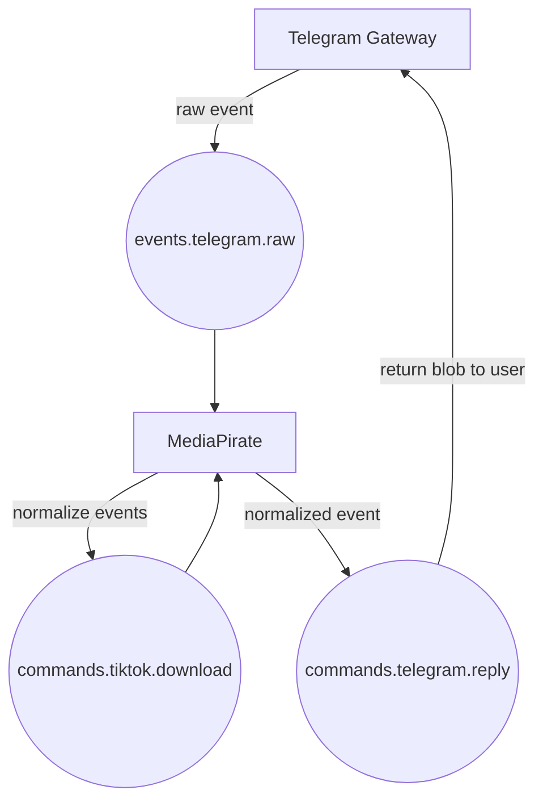

# Heavy Telegram Bot

## Project Overview

This repository contains the core infrastructure and multiple microservices/apps for our event-driven Telegram ecosystem.

## Infrastructure Services

Infrastructure is managed via Docker Compose in:

- [`infra/docker-compose.yml`](./infra/docker-compose.infra.yml)

This includes:

- RabbitMQ (message broker)
- Redis (cache and ephemeral store)
- MinIO (object storage)
- RedisInsight (Redis UI)

### Starting Infrastructure

Run the following command to start all infra services after setting up the envs:

```bash
docker-compose -f infra/docker-compose.yml up -d
```

## Gateway Service

The gateway service is a Python application that listens to Telegram events using Hydrogram and publishes these events into RabbitMQ.

- Located in the [`gateway/`](./gateway) directory.
- See [`gateway/README.md`](./gateway/README.md) for detailed setup and usage instructions.

### Running the Gateway Service

Before starting the Gateway service, ensure your infrastructure services are running.

You can run the Gateway service locally using:

```bash
docker-compose -f gateway/docker-compose.yml up -d
```

## MediaPirate Service

The MediaPirate service is a Python application that listens for events from RabbitMQ. This application will act to be a youtube, tiktok and whatnot downloader.

- Located in the [`media-pirate/`](./media-pirate) directory.
- See [`media-pirate/README.md`](./media-pirate/README.md) for detailed setup and usage instructions.

### Tasks

- [ ] Handle youtube downloads directly to disk
- [ ] Handle file uploading to minio
- [ ] Add checks to make sure they are small downloads
- [ ] Add big downloads via durable idempotent jobs that can be safely retried

### Supported Command Words

- `.dl` followed by a valid url, and a download will be attempted
- `.dl` replied to a valid url, and a download will be attempted

### Running the MediaPirate Service

Before starting the MediaPirate service, ensure your infrastructure services are running.

You can run the MediaPirate service locally using:

```bash
docker-compose -f media-pirate/docker-compose.yml up -d
```

## Logger Service

The Logger service is a Golang application that listens to log events from RabbitMQ. This application will serve as a central hub to store logs to find our what is happening in our even choreography.

## Current



## Planned


