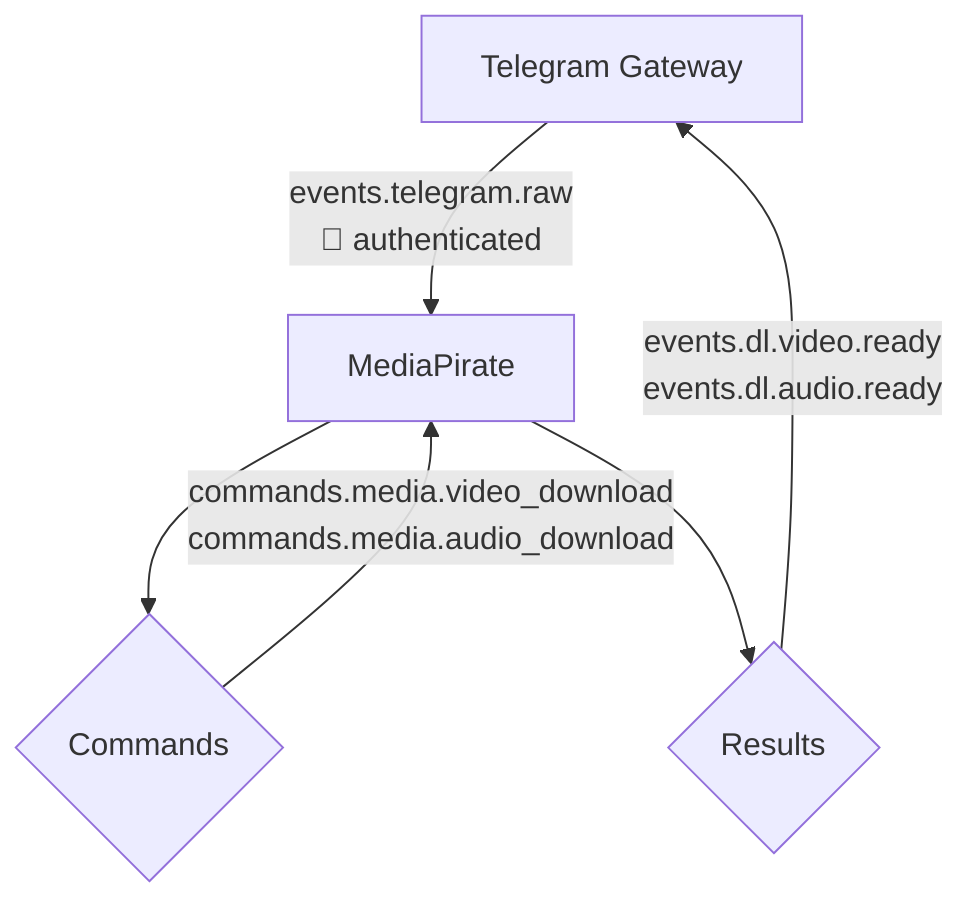
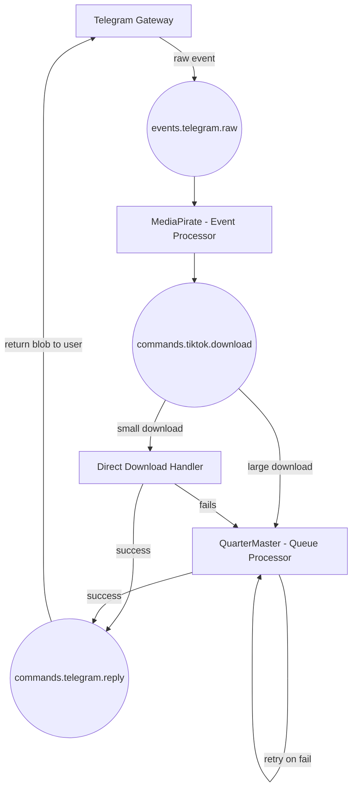

# Heavy Telegram Bot

TLDR: An intentionally overengineered Telegram userbot ecosystem built for architectural play, event choreography, and modular experimentation.

## Project Overview

This repository contains the core infrastructure and microservices for an event-driven (not distributed yet!) Telegram user-bot ecosystem. The project is intentionally overengineered — an experiment in modular design and event choreography using modern tooling.

⚠️ This project logs in as a user account using MTProto. Be aware that using userbots may violate Telegram’s terms of service. Use responsibly and at your own risk.

## Architecture Decisions

- **Correlation Context** - Handling `correlation_id` in a sane manner
- **Event Choreography over Orchestration** - Services react to events independently
- **Saga Pattern** - Distributed workflow without central coordinator
- **Interest Accumulation** - An approach to handling concurrent requests
- **Rate Limiting** - Limiting usage of services

### Correlation Context

_A Correlation ID is a unique identifier that is added to the very first interaction (incoming request) to identify the context and is passed to all components._ - Microsoft

This system does the same. When an event is received from Telegram into Gateway, we generate a `correlation_id` (a uuid) and associate the Telegram payload with it. This `correlation_id` is passed into the message queue, so that the other services that receive it also have access to its origin.

Originally, we were only relying on the `correlation_id` to log data. Without `correlation_id`s, when a user sends a message that triggers multiple services, there's no way to trace that single user action across service boundaries. When something fails, you're left digging through logs from different services trying to piece together what belonged to the same user request.

Normally, I would have just passed the `correlation_id` into a logger. But other than on the top most level, it becomes very difficult to uto that. You can imagine how a naive solution would have been to just have every single function you write have the parameter for `correlation_id`.

It became very bothersome to juggle this value. I needed an easier way to do this. I imagined that something like React's `useContext` would have been very useful at this moment.

So in Gateway and MediaPirate, we rely on `contextvars`

```python
import contextvars

correlation_id_var = contextvars.ContextVar("correlation_id", default="-")


def set_correlation_id(corr_id: str) -> None:
   correlation_id_var.set(corr_id)


def get_correlation_id() -> str:
   return correlation_id_var.get()

```

When you set the `correlation_id` with this at either the point of creation or inheriting it from another service.

Once you invoke the `set_correlation_id` function, it sets a `correlation_id`, and is accessible throughout the lifetime of this function - as long as you call the functions that handle the events inside this scope. So far under light load, in in async python, we have no had context corruption. It is not only accessible on the main function's context, but also all child functions all the way down the callstack.

In a loop, if you set the `correlation_id` at the top, all invoked functions, you are automatically setting the correct `correlation_id` for every iteration. It thus becomes a dead simple matter to call the `get_correlation_id()` function to get it.

In MediaPirate, we listen to an event queue from RabbitMQ, and are looping over this. Every event in this queue has a `correlation_id`. This method allows us to have global access to the `correlation_id` for the entire lifecycle any event arbitrarily.

#### Main Event Loop

```python
async with queue.iterator() as queue_iter:
    async for message in queue_iter:
        async with message.process():
            body_str = message.body.decode()

            try:
                body = json.loads(body_str)
            except json.JSONDecodeError:
                ctx.logger.error(
                    f"Invalid JSON in message")
                # Do something with the malformed JSON's later
                continue
            except Exception as e:
                ctx.logger.error(
                    f"Error processing: {e}")
                continue

            event_type: str = body.get('type', '')
            version = int(body.get('version')) if body.get(
                'version') is not None else None
            correlation_id: str = body.get('correlation_id', '')
            timestamp: str = body.get('timestamp', '')

            if not correlation_id:
                ctx.logger.error(
                    "Fatal: Missing correlation_id in event payload")
                raise ValueError(
                    "correlation_id is required for all events")

            set_correlation_id(correlation_id)

```

We validate the basic structure of the event payload, and then set it. Effectively, if if a bad payload is received, then we skip the iteration. We don't need to clean up the `correlation_id`, because it is only set for a valid payload.

Please note that conditionally setting `correlation_id` in this function is a horrible idea, this will make the event handler remember a previous iterations `correlation_id`, and thus lead to incorrect contextual logging.

Unlike React's `useContext` which prevents prop drilling in component trees, `contextvars` prevents parameter drilling in call stacks.

#### Example Code

Invoking loggers.

```python
                    event_type: str = body.get('type', '')
                    version = int(body.get('version')) if body.get(
                        'version') is not None else None
                    correlation_id: str = body.get('correlation_id', '')
                    timestamp: str = body.get('timestamp', '')

                    set_correlation_id(correlation_id)

                    if version is None:
                        ctx.logger.info(
                            f"Event does not have a version. Malformed event payload.")
                        continue

                    # Proper formatting with placeholders
                    match event_type:
                        case 'events.telegram.raw':
                            payload = body.get('payload', {})
                            data = normalize_telegram_payload(payload)

                            ctx.logger.info(
                                f"Event received successfully",
```

The logger formatter. Essentially, the logger used in MediaPirate use this formatter. And this formatter gets the `correlation_id`, and simply adds it the logging output.

```python
class ContextualColorFormatter(logging.Formatter):
    RESET = "\033[0m"
    RED = "\033[31m"
    GREEN = "\033[32m"
    YELLOW = "\033[33m"
    BLUE = "\033[34m"
    CYAN = "\033[36m"
    MAGENTA = "\033[35m"
    GRAY = "\033[90m"

    LEVEL_COLOR = {
        "DEBUG": CYAN,
        "INFO": GREEN,
        "WARNING": YELLOW,
        "ERROR": RED,
        "CRITICAL": MAGENTA,
    }

    STANDARD_ATTRS = logging.LogRecord(
        name="", level=0, pathname="", lineno=0, msg="", args=(), exc_info=None
    ).__dict__.keys()

    def format(self, record):
        # Add correlation ID
        record.correlation_id = get_correlation_id()

        # Colorize levelname and logger name
        color = self.LEVEL_COLOR.get(record.levelname, self.RESET)
        record.levelname = f"{color}{record.levelname}{self.RESET}"
        record.name = f"{self.BLUE}{record.name}{self.RESET}"

        # Get base log message
        base_message = super().format(record)

        # Extract custom extras
        extras = {
            k: v for k, v in record.__dict__.items()
            if k not in self.STANDARD_ATTRS and k != "message"
        }

        # Format extras nicely
        if extras:
            max_key_len = max(len(k) for k in extras)
            extra_lines = "\n".join(
                f"    {self.GRAY}{k.ljust(max_key_len)}{self.RESET} = {v!r}" for k, v in extras.items()
            )
            return f"{base_message}\n{self.CYAN}Extras:{self.RESET}\n{extra_lines}"
        else:
            return base_message
```

Event loop exit. We do this to prevent correlation context corruption.

```python
        case _:
            # TODO: publish these events to an DLQ
            ctx.logger.warning(
                "Unknown event_type received.",
                extra={"event_type": event_type}
            )

    # Sanity check before completing
    actual_correlation_id = get_correlation_id()
    expected_correlation_id = correlation_id
    if actual_correlation_id != expected_correlation_id:
        raise RuntimeError(
            f"Context corruption detected! Expected {expected_correlation_id}, "
            f"got {actual_correlation_id}"
        )
```

#### Correlation Keys

This provides us a very easy way to generate deterministic keys derived from the `correlation_id`.

```python
key = f"correlation_id:{correlation_id}:when-user-did-an-important-thing:message-id"
```

This application uses such correlation keys, to put values in Redis. This basically... lets us share global state across the entire system. Its fast, its light, you can make them self-clean with expiries.

Eg: This lets Gateway set a correlation key, and then have MediaPirate have access to it. It works much the same way a global state management solution would work in React.

### Interest Accumulation

When multiple users request the same media file, we track their interest via a shared Redis key (based on content hash or normalized URL). Once the download completes, all interested parties are notified. This prevents duplicate downloads and reduces resource use.

### Rate limiting

Strategy: Fixed Window Rate Limiting with TTL

This strategy limits how many actions a user can perform within a fixed time window. It uses a Redis key per user (e.g. rate:user:<id>) to count requests. The counter resets after a set TTL (e.g. 60 seconds), allowing automatic cleanup. If the request count exceeds the allowed limit during the window, further requests are denied until the TTL expires.

Since we are publishing raw telegram events from Gateway into the message broker we can't blindly increment the usage count with this event. Instead, we are allowing services to decide when to increment the usage count. **This should be done after meaningful events.**

#### Note:

The Gateway does not know what any of the services do, so we cant handle this logic inside it. Taking the event parsing logic from other services and putting it in Gateway will unfortunately become unmaintainable as there are more services - it would also lead to use maintaining multiples places with the same parsing logic.

Normalizing telegram events to application events in the Gateway is a solution. This would make things more robust and structured, but would also make adding new features more involved. This also goes against choreographing events.

In favor on keeping things easy to extend for now, we will be delegating rate limiting to the service level.

## Security Model

- Gateway authenticates all incoming requests.
- Correlation IDs, user metadata, or scoped access tokens are attached to events at this boundary.
- Internal services trust messages from the Gateway (or each other) and do not perform redundant authentication.

This approach simplifies each worker’s responsibility and centralizes control.

## Insights

### Event-Driven Architecture & React Development is Surpassingly Similar

Event-based programming has a remarkably similar feel to React programming. Both paradigms share fundamental patterns that make the mental model transferable:

#### Unidirectional Data Flow

- React: Props flow down, events bubble up through component hierarchy
- Event Systems: Events flow through message queues, responses bubble back through services

#### Event Handling

- React: So many ways to do it. `onClick` to handle user click events. `useEffect` to react to changes in reactive state. Most of these functions don't return anything, they just do things.
- Event systems: subscribers listen to events, and do something. It doesn't make sense to return anything when it's event based, you just pass it to the next step in the flow, or end the process.

#### Global State Management

- React: You want to share lift up reactive state to share across different parts of your application tree, you reach out for `context` or a global state management library, and implement it with a setter and a getter.
- Event Systems: Redis for state management - effectively state that has been lifted to share across different parts. But its more powerful, you can set automatic cleanups with TTL (You do have similar ability to clean up in React via returning a cleanup function in a `useEffect`).

#### Event Propagation

- React: Event bubbling through the DOM tree with `stopPropagation()` control
- RabbitMQ: Exchange types (direct, fanout, topic) for controlling event distribution patterns. You can change whether multiple consumers receives the same event, or whether they disappear after an event has been touched by a subscriber.

#### Composition

- React: You can separate out functionality via `hooks` and `components`. Encapsulated boxes that take props and output behavior or UI. Components can be dumb (they don't do business logic, and just react to props) or they can be smart (they take care of business logic, calling endpoints, handling toast notifications)
- Microservices: Break out functionality into its own service. They can either dumbly call other events to handle logic it cant do, or they can take care of everything.

This mental models transfer suggests that frontend developers already possess much of the conceptual framework needed for distributed systems architecture. The shift from "what happens when a button is clicked?" to "what happens when an event is published?" feels very natural.

Both types of programming have similar reactive event-driven flows.

## Getting Started

1. Start the infrastructure
2. Start the Gateway
3. Start MediaPirate

You should now be able to interact with the bot via Telegram.

## Infrastructure Services

Infrastructure is managed via Docker Compose in:

- [`infra/docker-compose.yml`](./infra/docker-compose.yml)

This includes:

- 📨 **RabbitMQ** - message broker
- 🧠 **Redis** - cache and ephemeral data store
- 💾 **MinIO** - S3-compatible object storage
- 🧭 **RedisInsight** - Redis UI for debugging and introspection

### Starting Infrastructure

Ensure you’ve configured the necessary environment variables, then start the services:

```bash
docker-compose -f infra/docker-compose.yml up -d
```

## Gateway Service

> **📤 Event Publisher**  
> Listens to Telegram events and publishes them into RabbitMQ.

### What it is

The Gateway service is a Python application that listens to Telegram events using Hydrogram and publishes them to RabbitMQ.

- Located in the [`gateway/`](./gateway) directory.
- See [`gateway/README.md`](./gateway/README.md) for detailed setup and usage instructions.

### Key features

- Associating logs with correlation IDs handling using `contextvars`
- Computes time taken for event to be received into Gateway and dispatched out of Gateway
- Speeds up user response by reusing videos and audios already uploaded to Telegram if available via a Redis hashmap. If the uploaded link is expired, we default to fetching the data from object storage via a presigned url.
- Cleans up files saved to disk via an Redis counter. Files are deleted oldest first.
- Adds metadata to the event envelope letting subscribers know if the event comes from a user that has been rate limited
- File handling interest accumulation

#### Interest Accumulation

To upload a file do Telegram you can use a actual file on disk, or the `file_id` on Telegram's servers. The issue here is that the `file_id` on telegram expires.

When we send videos and audios back to the user, we are first trying to see if we have access to a cached `file_id`, and if it is not available, then we get the file from our object storage via a supplied presigned get request.

When sending the uploading the object to telegram, we also check if it exists in the temp downloads directory, and it doesn't, we download it. So there's 2 checks until this point. Check redis cache for a telegram `file_id`, and if not available get a fresh copy from object storage.

If an upload to telegram is successful, we cache it to use later. These cached `file_id`s expire.

The issue here is that, what if multiple people are requesting for an object that is not on disk (a fresh video source).

Now, functionally, this issue can be resolved by using the `correlation_id` as a filename for the initial download, and then then renaming it to the actual object's name after it has been uploaded to telegram. But it would still do redundant computations: downloading, renaming and deleting files - when 2 files that have different `correlation_id` map to the same actual object name. This will occur, because we need to content based addressing needs maps to the same file when given the same content (content being the presigned url in this case).

So what we have instead opted for the following process:

- Every presigned url will map to an `interest_accumulator_key` to use a a lock
- We will check if the `interest_accumulator_key` lock exists, before doing any processing, and then republish an event after a small delay if it does.
- If the `interest_accumulator_key` does not exist, then we will process it normally.

This process gives us the ability to delay events that are being locked, but when they come back... they will get the `file_id` that was cached. The accumulator pattern relies of the redis cache!

_The delayed requests essentially become cache hits rather than duplicate work - transforming a coordination problem into a caching optimization._

### Task Roadmap

- [x] Listen for video downloads events, and upload from minio into telegram
- [x] Optimize video uploading, by reusing documents already in telegram
- [ ] JSON Schema implementation
- [ ] Add support for dynamically allowing other users to interact with certain functionality
- [x] Implement basic authentication
- [ ] Implement dynamic authorization and only publish events that have to be worked on
- [ ] Implement OpenTelemetry with `contextvars` correlation support
- [ ] Implement Redis TTL-based heartbeat for service health
- [x] Handle race condition via interest accumulation. Decouple download requests from download execution - accumulate interested parties and fan-out results for success and failed for all interested parties.

### Supported Command Words (🚧 PLANNED)

- `.whoami` — tells the user their current status (banned, blessed, or unmolested)
- `.grace <30d?>` — Allow a chat to interact with the bot forever, or with an optional TTL
- `.bless @<username> <30d?>` — Bless user for 30 days, with an optional TTL
- `.smite` — Permanent ban from bot interactions for everyone in chat forever (no TTL)
- `.hammer @<username> <1h?>` — Temporary ban, with an optional TTL

### Running the Gateway Service

Start after infrastructure is running:

```bash
docker-compose -f gateway/docker-compose.yml up -d
```

## MediaPirate Service

> **📥 Event Subscriber & Event Publisher**  
> Consumes raw events from RabbitMQ and processes or delegates them.

### What it is

MediaPirate is a distributed content relay and command system designed to experiment with messaging patterns, service orchestration, and multi-user sync.

- Located in the [`media-pirate/`](./media-pirate) directory.
- See [`media-pirate/README.md`](./media-pirate/README.md) for detailed setup and usage instructions.

### Key features

- Associating logs with correlation IDs handling using `contextvars`
- Injecting `correlation_id` received from Gateway for inter-service context-aware logging
- Content-Based Addressing for object storage
- Fetching from Youtube, Tiktok, and anything else that is supported by `yt-dlp` is handled in an idempotent manner
- Enriches stored documents with meta data for future analytics
- Rate limits usage based on time and user.

#### Content-Based Addressing

This project uses a content-based addressing strategy to deduplicate downloads and maintain consistency across services. Each media object is identified by a unique hash derived from the normalized source URL (with query parameters stripped) and the extraction type (audio or video). This allows media derived from the same URL — but with different formats or intents — to be treated as distinct entities.

The content hash is used to:

- Uniquely identify media across services
- Prevent redundant downloads/uploads
- Store files in MinIO under type-scoped paths: audio/<hash>.mp3 and video/<hash>.mp4

The full source URL and normalized form are preserved as metadata to ensure traceability, support introspection, and allow for future normalization improvements.

### Task Roadmap

- [x] Handle YouTube downloads directly to disk
- [x] Upload downloaded files to MinIO
- [ ] Enforce file size limits for small downloads
- [ ] Implement durable, idempotent jobs for large downloads with retry support
- [ ] JSON Schema implementation (cross-service payload validations)
- [ ] Implement OpenTelemetry with `contextvars` correlation support
- [ ] Implement Redis TTL-based heartbeat for service health
- [ ] Reuse downloaded files when doing audio extraction (if a video exists inside the bucket)

### Supported Command Words

- `.vdl <url>` — Download a file from a given URL
- `.vdl` (as a reply) — Download a file from the replied message
- `.adl <url>` — Download and extract the audio from a given URL
- `.adl` (as a reply) — Download and extract the audio from the replied message

### Running the MediaPirate Service

Ensure infrastructure is running before starting:

```bash
docker-compose -f media-pirate/docker-compose.yml up -d
```

## QuarterMaster Service (🚧 PLANNED)

> **📥 Event Subscriber & Job Processor**  
> Consumes download job events from RabbitMQ and processes them reliably.

QuarterMaster is a Python service responsible for consuming download-related events from RabbitMQ and dispatching durable, long-running download jobs. It is designed to handle large downloads and rate-limited sources with support for:

- Resumable downloads (planned feature)
- Retry and failure handling
- Persistence and idempotency for reliable processing

This service acts as the heavy-duty worker in your media pipeline, offloading complex or resource-intensive tasks from the MediaPirate service.

- Located in the [`quarter-master/`](./quarter-master) directory.
- See [`quarter-master/README.md`](./quarter-master/README.md) for detailed setup and usage instructions.

## Logger Service (🚧 PLANNED)

> **📥 Event Subscriber**  
> Consumes logging events from RabbitMQ and find a place to stash them.

The Logger service is a Go application that listens to log events from RabbitMQ and stores them centrally. It provides visibility into system behavior across services and helps monitor event choreography.

## 🧩 Current Flow



## 🚧 Planned Flow


