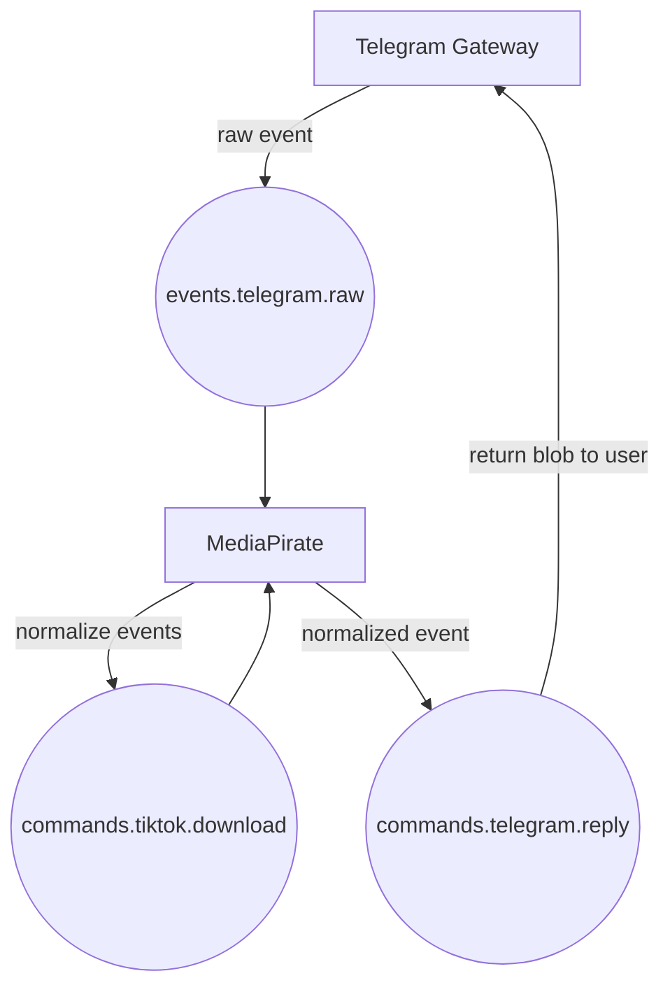

# Heavy Telegram Bot

## Project Overview

This repository contains the core infrastructure and microservices for an event-driven Telegram bot ecosystem. The project is intentionally overengineered — an experiment in distributed systems and event choreography using modern tooling.

## Infrastructure Services

Infrastructure is managed via Docker Compose in:

- [`infra/docker-compose.yml`](./infra/docker-compose.yml)

This includes:

- 📨 **RabbitMQ** — Message broker
- 🧠 **Redis** — Cache and ephemeral data store
- 💾 **MinIO** — S3-compatible object storage
- 🧭 **RedisInsight** — Redis UI for debugging and introspection

### Starting Infrastructure

Ensure you’ve configured the necessary environment variables, then start the services:

```bash
docker-compose -f infra/docker-compose.yml up -d
```

## Gateway Service

The Gateway service is a Python application that listens to Telegram events using Hydrogram and publishes them to RabbitMQ.

- Located in the [`gateway/`](./gateway) directory.
- See [`gateway/README.md`](./gateway/README.md) for detailed setup and usage instructions.

### Running the Gateway Service

Make sure the infrastructure is running first, then start the Gateway:

```bash
docker-compose -f gateway/docker-compose.yml up -d
```

## MediaPirate Service

MediaPirate is a Python service that consumes Telegram-related events from RabbitMQ and handles downloads from platforms like YouTube and TikTok.

- Located in the [`media-pirate/`](./media-pirate) directory.
- See [`media-pirate/README.md`](./media-pirate/README.md) for detailed setup and usage instructions.

### Task Roadmap

- [x] Handle YouTube downloads directly to disk
- [ ] Upload downloaded files to MinIO
- [ ] Enforce file size limits for small downloads
- [ ] Implement durable, idempotent jobs for large downloads with retry support

### Supported Command Words

- `.dl <url>` — Download a file from a given URL
- `.dl` (as a reply) — Download a file from the replied message

### Running the MediaPirate Service

Ensure infrastructure is running before starting:

```bash
docker-compose -f media-pirate/docker-compose.yml up -d
```

## Logger Service

The Logger service is a Go application that listens to log events from RabbitMQ and stores them centrally. It provides visibility into system behavior across services and helps monitor event choreography.

## 🧩 Current Flow



## 🚧 Planned Flow


