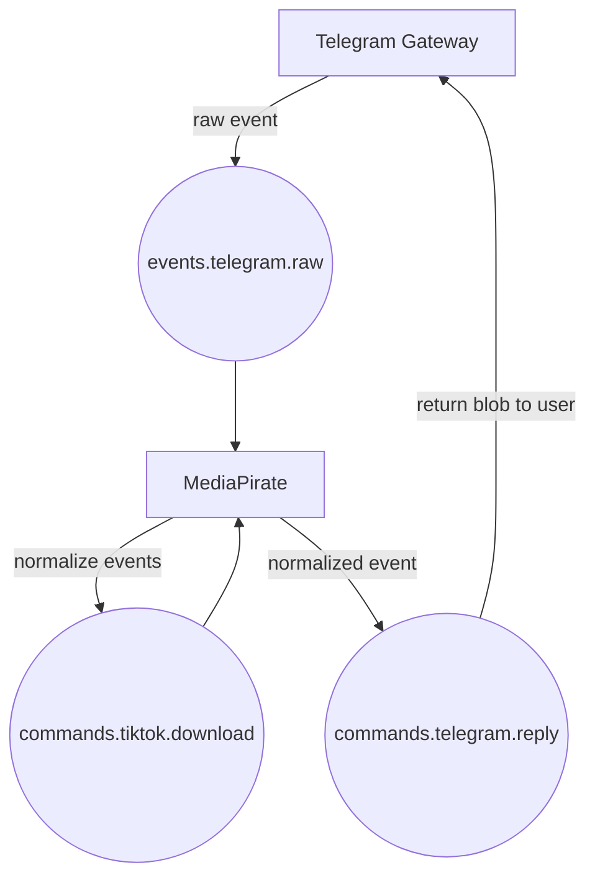
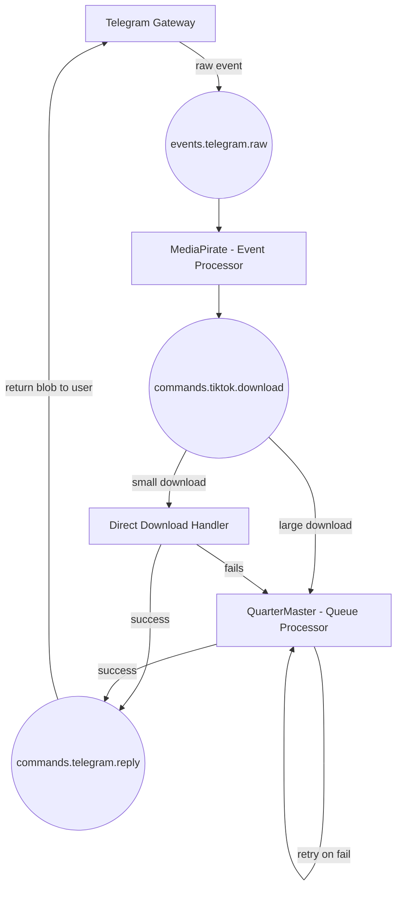

# Heavy Telegram Bot

## Project Overview

This repository contains the core infrastructure and microservices for an event-driven Telegram bot ecosystem. The project is intentionally overengineered — an experiment in distributed systems and event choreography using modern tooling.

## Getting Started

1. Start the infrastructure
2. Start the Gateway
3. Start MediaPirate

You should now be able to interact with the bot via Telegram.

## Architecture Decisions

- **Event Choreography over Orchestration** - Services react to events independently
- **Saga Pattern** - Distributed workflow without central coordinator
- **Interest Accumulation** - An approach to handling concurrent requests

### Interest Accumulation

When multiple users request the same media file, we track their interest via a shared Redis key (based on content hash or normalized URL). Once the download completes, all interested parties are notified. This prevents duplicate downloads and reduces resource use.

## Infrastructure Services

Infrastructure is managed via Docker Compose in:

- [`infra/docker-compose.yml`](./infra/docker-compose.yml)

This includes:

- 📨 **RabbitMQ** — message broker
- 🧠 **Redis** — cache and ephemeral data store
- 💾 **MinIO** — S3-compatible object storage
- 🧭 **RedisInsight** — Redis UI for debugging and introspection

### Starting Infrastructure

Ensure you’ve configured the necessary environment variables, then start the services:

```bash
docker-compose -f infra/docker-compose.yml up -d
```

## Gateway Service

> **📤 Event Publisher**  
> Listens to Telegram events and publishes them into RabbitMQ.

### What it is

The Gateway service is a Python application that listens to Telegram events using Hydrogram and publishes them to RabbitMQ.

- Located in the [`gateway/`](./gateway) directory.
- See [`gateway/README.md`](./gateway/README.md) for detailed setup and usage instructions.

### Key features

- Associating logs with correlation IDs handling using `contextvars`

### Task Roadmap

- [x] Listen for video downloads events, and upload from minio into telegram
- [ ] Optimize video uploading, by reusing documents already in telegram
- [ ] JSON Schema implementation
- [ ] Implement rate limiting to prevent users from spamming the service
- [ ] Implement Open Telemetry (use the correlation ids already being propagated via `contextvars`)
- [ ] Add support for dynamically allowing other users to interact with certain functionality
- [x] Implement basic authentication
- [ ] Implement dynamic authorization and only publish events that have to be worked on
- [ ] Implement rate limiting
- [ ] Implement OpenTelemetry with `contextvars` correlation support
- [ ] Implement Redis TTL-based heartbeat for service health

### To Be Supported Command Words

- `.grace 30d?` — Allow a chat to interact with the bot forever, or with an optional TTL
- `.bless @<username> 30d?` — Bless user for 30 days, with an optional TTL
- `.hammer @<username> 1h?` — Temporary ban, with an optional TTL
- `.smite` — Permanent ban from bot interactions for everyone in chat forever (no TTL)

### Running the Gateway Service

Start after infrastructure is running:

```bash
docker-compose -f gateway/docker-compose.yml up -d
```

## MediaPirate Service

> **📥 Event Subscriber & Event Publisher**  
> Consumes raw events from RabbitMQ and processes or delegates them.

### What it is

Media Pirate is a distributed content relay and command system designed to experiment with messaging patterns, service orchestration, and multi-user sync.

- Located in the [`media-pirate/`](./media-pirate) directory.
- See [`media-pirate/README.md`](./media-pirate/README.md) for detailed setup and usage instructions.

### Key features

- Associating logs with correlation IDs handling using `contextvars`
- Injecting `correlation_id` received from Gateway for inter-service context-aware logging
- Fetching from youtube, tiktok is handled in an idempotent manner
- Enriches stored documents with meta data for future analytics

### Task Roadmap

- [x] Handle YouTube downloads directly to disk
- [x] Upload downloaded files to MinIO
- [ ] Enforce file size limits for small downloads
- [ ] Implement durable, idempotent jobs for large downloads with retry support
- [ ] JSON Schema implementation (cross-service payload validations)
- [ ] Implement Open Telemetry (use the correlation ids already being propagated via `contextvars`)
- [ ] Handle race condition via interest accumulation. Decouple download requests from download execution - accumulate interested parties and fan-out results for success and failed for all interested parties.
- [ ] Implement OpenTelemetry with `contextvars` correlation support
- [ ] Implement Redis TTL-based heartbeat for service health

### Supported Command Words

- `.vdl <url>` — Download a file from a given URL
- `.vdl` (as a reply) — Download a file from the replied message
- `.adl <url>` — Download and extract the audio from a given URL
- `.adl` (as a reply) — Download and extract the audio from the replied message

### Running the MediaPirate Service

Ensure infrastructure is running before starting:

```bash
docker-compose -f media-pirate/docker-compose.yml up -d
```

## QuarterMaster Service (🚧 PLANNED)

> **📥 Event Subscriber & Job Processor**  
> Consumes download job events from RabbitMQ and processes them reliably.

QuarterMaster is a Python service responsible for consuming download-related events from RabbitMQ and dispatching durable, long-running download jobs. It is designed to handle large downloads and rate-limited sources with support for:

- Resumable downloads (planned feature)
- Retry and failure handling
- Persistence and idempotency for reliable processing

This service acts as the heavy-duty worker in your media pipeline, offloading complex or resource-intensive tasks from the MediaPirate service.

- Located in the [`quarter-master/`](./quarter-master) directory.
- See [`quarter-master/README.md`](./quarter-master/README.md) for detailed setup and usage instructions.

## Logger Service (🚧 PLANNED)

> **📥 Event Subscriber**  
> Consumes logging events from RabbitMQ and find a place to stash them.

The Logger service is a Go application that listens to log events from RabbitMQ and stores them centrally. It provides visibility into system behavior across services and helps monitor event choreography.

## 🧩 Current Flow



## 🚧 Planned Flow


